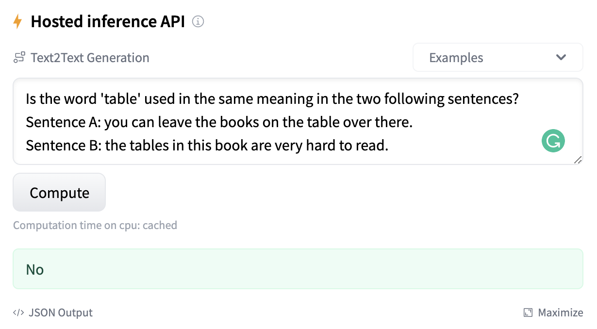

# Running inference with T0

    

You can try T0 directly in your browser with the [inference widget](https://huggingface.co/bigscience/T0pp). However, if you want to perform inference locally, there are multiple ways to run inference with T0 on one or multiple GPUs depending on your compute ressources. You can always perform inference on CPU though it will likely be quite slow.

If you have **multiple GPUs**, you can use model parallelism which will split the model across all available devices. [`model_parallelism.py`](model_parallelism.py) shows how to leverage model parallelism to run inference of [T0++](https://huggingface.co/bigscience/T0pp).

Please note that `parallelize` is still experimental in 🤗 Transformers. To run the biggest variants of T0 with 11B parameters (T0, T0+, and T0++), you will need enough GPUs to fit ~42GB of fp32 parameters. For example, a node with 2 32GB V100 or with 4 16GB V100 is suitable.

If you have access to only **one GPU**, you can use parameter offloading though it requires a **significant amount of CPU memory**. [`model_offload.py`](model_offload.py) shows how to leverage ZeRO-3 parameter offloading implemented in [Deepspeed](https://github.com/microsoft/DeepSpeed) to run inference of [T0++](https://huggingface.co/bigscience/T0pp) on a single GPU. Please refer to  [Deepspeed](https://github.com/microsoft/DeepSpeed) for installation details.

In any cases, to manipulate the biggest variants of T0 (11B parameters) you will need ~90GB of CPU memory to load the model in memory. If this is an issue, consider using [T0 3B](https://huggingface.co/bigscience/T0_3B) which is a smaller variant of T0.

Moreover, we highly advise against performing inference in fp16 as the predictions will be unreliable and don't represent well the performance of the model.
